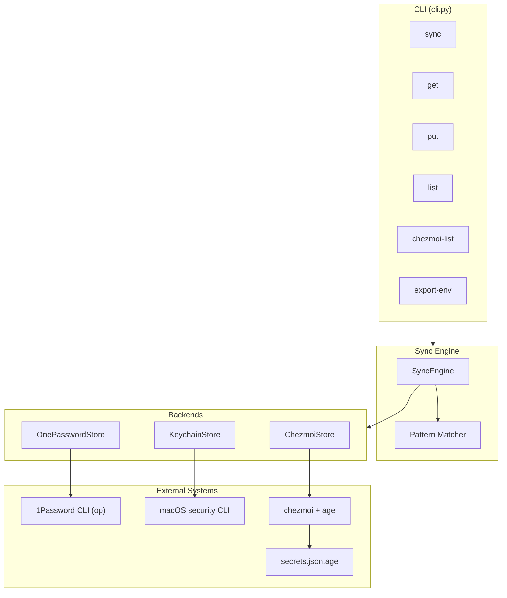
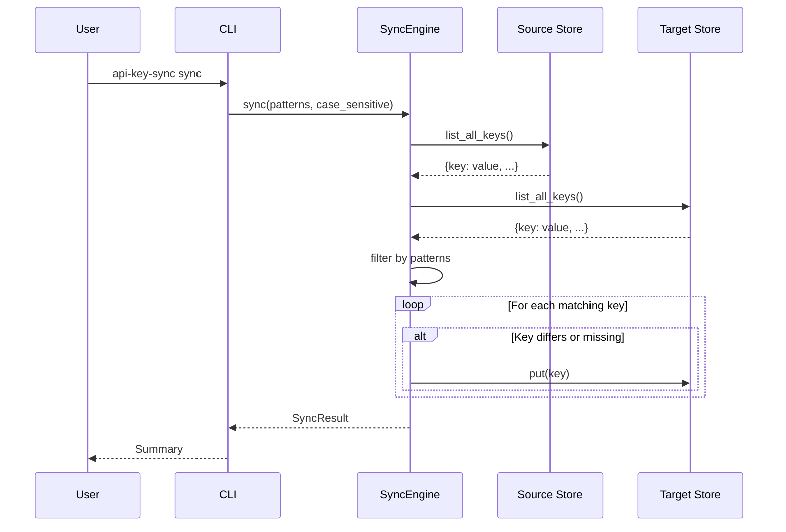

# API Key Sync

Sync API keys between 1Password, Apple Keychain, and Chezmoi with automatic pattern-based discovery.

## Features

- **Automatic Discovery**: Finds keys matching patterns like `_API_KEY`, `_TOKEN`, `_SECRET`
- **Multi-Backend Support**: Sync between 1Password, macOS Keychain, and Chezmoi
- **Bidirectional Sync**: Sync in any direction between supported backends
- **Name Style Conversion**: Automatic UPPER_CASE ↔ lower_case mapping for Chezmoi
- **Case Sensitivity Control**: Match patterns case-sensitively or case-insensitively
- **Dry Run Mode**: Preview changes before applying
- **Export to Environment**: Generate shell export commands

## Architecture



## Sync Flow



## Prerequisites

- macOS (uses `security` CLI for Keychain access)
- [1Password CLI](https://developer.1password.com/docs/cli/) (`op`) installed and authenticated
- [Chezmoi](https://www.chezmoi.io/) with age encryption configured (for Chezmoi sync)
- Python 3.11+
- [uv](https://github.com/astral-sh/uv) package manager

## Installation

```bash
uv tool install .
```

## Configuration

### Pattern-Based Discovery (Default)

Keys are automatically discovered if their names contain any of these patterns:

| Pattern | Example Matches |
|---------|-----------------|
| `_TOKEN` | `GITHUB_TOKEN`, `HF_TOKEN` |
| `_API` | `OPENAI_API_KEY`, `COHERE_API` |
| `_KEY` | `ANTHROPIC_API_KEY`, `SSH_KEY` |
| `_PASSWORD` | `VAULT_PASSWORD` |
| `_SECRET` | `AWS_SECRET_ACCESS_KEY` |
| `_CREDENTIAL` | `DB_CREDENTIAL` |

### Custom Patterns (Optional)

Override patterns in `~/.dotfiles/.config/zsh/config.d/api_keys.zsh`:

```zsh
API_KEY_PATTERNS=(_TOKEN _API _KEY _PASSWORD _SECRET)
```

## Usage

### Sync Keys

```bash
# 1Password → Keychain (default)
api-key-sync sync

# Preview changes without applying
api-key-sync sync --dry-run

# Keychain → 1Password
api-key-sync sync keychain-to-op

# Delete keys missing from source
api-key-sync sync --sync-deletions

# Case-insensitive pattern matching
api-key-sync sync --no-case-sensitive
```

### Sync with Chezmoi

Sync keys between 1Password and Chezmoi's age-encrypted `secrets.json.age`:

```bash
# 1Password → Chezmoi (preserves case by default)
api-key-sync sync op-to-chezmoi

# Chezmoi → 1Password
api-key-sync sync chezmoi-to-op

# Preview changes
api-key-sync sync op-to-chezmoi --dry-run

# Convert to UPPER_CASE
api-key-sync sync op-to-chezmoi --name-style upper

# List keys in chezmoi
api-key-sync chezmoi-list
api-key-sync chezmoi-list --no-case-sensitive
```

**Name Style Options:**
- `preserve`: Keep original case from source (default)
- `upper`: Convert to UPPER_CASE
- `lower`: Convert to lower_case

### Get a Single Key

```bash
api-key-sync get OPENAI_API_KEY --source keychain
api-key-sync get OPENAI_API_KEY --source op
```

### Store a Key

```bash
# Store in both 1Password and Keychain
api-key-sync put MY_API_KEY "secret_value"

# Store in specific target
api-key-sync put MY_API_KEY "secret_value" --target keychain
api-key-sync put MY_API_KEY "secret_value" --target op
```

### List Keys

```bash
# List keys in Keychain matching patterns
api-key-sync list

# List keys in 1Password
api-key-sync list --source op
```

### Export as Environment Variables

```bash
# One-time in current shell
eval "$(api-key-sync export-env)"

# Add to ~/.zshrc for automatic loading
source <(api-key-sync export-env)
```

## CLI Options

| Option | Description | Default |
|--------|-------------|---------|
| `--vault` | 1Password vault name | `API_KEYS` |
| `--service` | Keychain service name | `api-keys` |
| `--secrets-file` | Chezmoi secrets.json.age path | `~/.local/share/chezmoi/secrets.json.age` |
| `--name-style` | Name conversion: preserve, upper, lower | `preserve` |
| `--config` | Path to config file | `~/.dotfiles/.config/zsh/config.d/api_keys.zsh` |
| `--dry-run` | Preview changes without executing | `false` |
| `--sync-deletions` | Delete keys missing from source | `false` |
| `--case-sensitive` | Case-sensitive pattern matching | `true` |
| `--unlock` | Prompt to unlock keychain if locked | `false` |

## Project Structure

```
src/api_key_sync/
├── __init__.py        # Public API exports
├── models.py          # APIKey dataclass, KeyStore protocol
├── config.py          # Pattern matching and config loading
├── sync.py            # SyncEngine with pattern-based discovery
├── cli.py             # Typer CLI commands
└── backends/
    ├── __init__.py
    ├── onepassword.py # 1Password CLI wrapper
    ├── keychain.py    # macOS Keychain wrapper
    └── chezmoi.py     # Chezmoi age-encrypted secrets wrapper
```

## Development

```bash
# Install dependencies
uv sync

# Run tests
uv run pytest

# Run tests with coverage
uv run pytest --cov=api_key_sync

# Format code
uv run ruff format src/ tests/

# Lint code
uv run ruff check src/ tests/
```

## License

MIT
